<h3><code>wairiukoirwine@github ~ $ ./contributions.sh</code></h3>

  

<h3><code>wairiukoirwine@github ~ $ whoami</code></h3>
<table>
  <tr>
    <td valign="top"></td>
    <td valign="top"></td>
  </tr>
</table>

##  Socials:
       

#  Tech Stack:
                          
#  GitHub Stats:
 
 

##  GitHub Trophies

###  Dev Quote

###  Top Contributed Repo

---

<!-- Proudly created with GPRM ( https://gprm.itsvg.in ) -->
